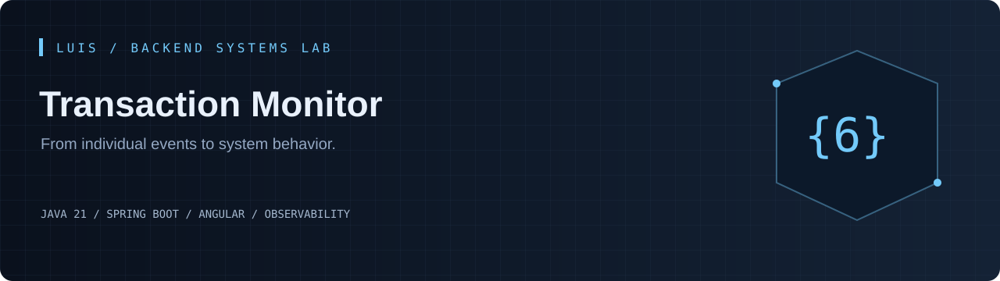
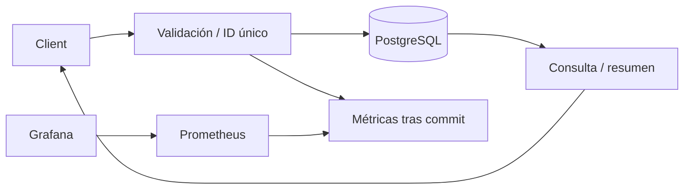

[](https://github.com/LuisDeveloper-Fer/transaction-monitor/actions/workflows/ci.yml)


[](LICENSE)

**Un contador global no explica qué servicio se degrada. Este proyecto registra eventos consultables y publica histogramas por servicio y resultado con cardinalidad controlada.**

Proyecto independiente del [Backend Systems Lab de Luis](https://github.com/LuisDeveloper-Fer). Código y datos de demostración, sin información propietaria ni dinero real.

## En 60 segundos

- Ingesta validada con ID único
- PostgreSQL/JPA, índices, paginación y filtros
- Resumen de totales, éxito/error y media
- Histogramas Micrometer sin IDs como etiquetas
- Prometheus y dashboard Grafana: TPS, errores, p95/p99

**Experimento principal:** Registra PAYMENTS, WEBHOOKS y RECONCILIATION con distintas duraciones y estados. Filtra por servicio y observa los histogramas en Grafana.

## Ejecutar

Requisitos: **JDK 21**, Maven 3.9+, Node 22.12+ para Angular y Docker Compose para el stack completo. [Compatibilidad de Spring Boot](https://docs.spring.io/spring-boot/system-requirements.html) · [Compatibilidad de Angular](https://angular.dev/reference/versions).

```bash
git clone https://github.com/LuisDeveloper-Fer/transaction-monitor.git
cd transaction-monitor
mvn clean package
docker compose up --build
```

| Componente | Dirección |
| --- | --- |
| Angular | http://localhost:4200 |
| API | http://localhost:8080 |
| Prometheus | http://localhost:9090 |
| Grafana | http://localhost:3000 · admin / local-demo-only |

Puertos publicados solo en loopback. Ejecuta un laboratorio a la vez o cambia API_PORT/UI_PORT/PROMETHEUS_PORT/GRAFANA_PORT en el entorno.

### Desarrollo local

```bash
mvn spring-boot:run
# otra terminal:
cd frontend
npm ci
npm start
```

Localmente usa H2 en memoria para arrancar y probar sin dependencias. **Compose usa PostgreSQL 17 con volumen persistente**. Configura DB_URL, DB_USER y DB_PASSWORD para otro datasource. Hibernate ddl-auto=update simplifica el laboratorio; producción requiere migraciones versionadas.

## Arquitectura



La base de datos conserva eventos; Prometheus conserva series temporales. Las métricas se publican después del commit para no inflar contadores ante rollback o duplicados. Existe una ventana entre commit y métrica: no es un libro contable. El conjunto fijo de servicios limita cardinalidad.

[Decisión técnica](docs/adr/001-design.md) · [Contrato de API](docs/api.md) · [Guion de entrevista](docs/interview.md)

## Primer request

```bash
curl -i -X POST http://localhost:8080/api/transactions \
  -H 'Content-Type: application/json' \
  --data '{"id":"10000000-0000-4000-8000-000000000001","service":"PAYMENTS","status":"SUCCESS","durationMs":250,"occurredAt":"2026-01-01T00:00:00Z"}'
```

Ejemplo de respuesta, campos relevantes:

```json
{
  "id": "10000000-0000-4000-8000-000000000001",
  "service": "PAYMENTS",
  "status": "SUCCESS",
  "durationMs": 250,
  "occurredAt": "2026-01-01T00:00:00Z"
}
```

IDs y fechas cambian en cada ejecución. [Colección curl](examples/requests.sh) · [Payload JSON](examples/request.json).

## Endpoints

| Método | Ruta | Resultado |
| --- | --- | --- |
| POST | `/api/transactions` | 201 nuevo; 409 duplicado |
| GET | `/api/transactions?page=0&size=20&service=PAYMENTS&status=ERROR` | Consulta; size máximo 100 |
| GET | `/api/transactions/{id}` | Detalle |
| GET | `/api/summary` | Total, success, error, averageDurationMs |
| GET | `/actuator/prometheus` | Histogramas y runtime |

## Pruebas

```bash
mvn clean package
cd frontend && npm ci && npm run build
```

Duplicado rechazado sin incrementar el histograma; evento original permanece consultable. Las pruebas no necesitan Docker y usan H2; no sustituyen una validación sobre PostgreSQL. CI compila Java y Angular. [Evidencia y límites de validación](docs/VALIDATION.md).

## Estructura

```text
src/main/java/dev/portfolio/
  api/              Contratos HTTP y validación
  application/      Casos de uso
  domain/           Estado y reglas
  infrastructure/   Clientes o repositorios
src/test/           Pruebas
frontend/           Angular standalone
ops/                Entorno de ejecución
docs/               Decisiones y guía técnica
examples/           Requests reproducibles
```

## Alcance honesto

Métricas del proceso actual, reiniciadas al arrancar; histórico SQL persistente. TPS es tasa de ingesta, no de ocurrencia remota. Sin retención automática ni motor OLAP. Las agregaciones SQL son sencillas y necesitarían evolucionar con el volumen.

API de laboratorio sin autenticación, enlazada localmente. [secure-api-demo](https://github.com/LuisDeveloper-Fer/secure-api-demo) aborda seguridad por separado.

## Para una entrevista

1. Reproduce el experimento principal y explica el resultado.
2. Identifica dónde termina cada transacción y qué garantiza.
3. Explica qué ocurre ante un reinicio o una solicitud duplicada.
4. Justifica qué cambiarías para operar varias instancias.

---

**LuisDeveloper-Fer** · Java Backend Developer · [Los seis laboratorios](https://github.com/LuisDeveloper-Fer) · [MIT](LICENSE)
